Midnight Snack is a terminal game in which you are given the role of a cat who needs your help in navigating through the maze to find a suitable midnight snack.


# Table Of Contents

1. [Statement of purpose and scope](#statement-of-purpose-and-scope)
2. [Features](#features)
3. [User interaction and experience](#user-interaction-and-experience)
4. [Control flow diagram](#control-flow-diagram)
5. [Help/Usage](#help)
6. [Testing](#testing)
7. [Original Board design](#original-board-design)
8. [Devlopment Log](#Development-Log)


## Statement of purpose and scope

##### What the game will do:

- The program will open, print text art of the title.
- It will print a greeting message and instructions - the user is informed they have to help the kitty find a midnight snack and help it get back to bed it also tells the user they can use "q" to quit the game and to use the arrow keys to move.
- They then have to move the kitty (emoji) down the path (down the screen through a path that is made out of keyboard symbols (text art)).
- Different paths will appear to the kitty depending on which path they take, different obstacles will pop up as well as different foods to eat or even dead ends. 
- Different messages will be printed during the game depending on which paths the user takes, the obstacle at hand, the foods the cat eats and then when the kitty arrives at its bed.
- To exit the game, the user may pres "q" or they may choose to find the kitty's bed to put it to bed. If they choose to find a bed to put the kitty to bed they can either choose their own bed or sleep on their humans face.
- As a nice to have feature, everything the kitty eats will fill up a fullness meter and when the metre is full, a full message will be printed, if they go over the metre, the kitty will go into a food coma and the game will end.

##### The problem to be solved and why it is being developed:

This app is being developed to challenge myself and to see what I can do with the content I have learned and continue to learn.  As well as being immersed in the software development process to understand how it is done.

##### The target audience and how a member of the target audience will use it:

- The target audience for this project is other coders, to appreciate and understand the process, as well as a way to utilize and showcase my talents.
- It can also be enjoyed by all cat lovers.
- This project will be added to my Github where other coders can download it to their local terminal and play it.

## Features

##### Essential features

1. The user moves a cat emoji through a path printed on the screen, using their arrow keys to navigate. The path will be made out of keyboard symbols and will go down the screen, branching off onto different paths where different obstacles or foods will be. At the very end of the path there will be a bed which the user has to find and then put the kitty to bed when he is full.
2. Along the path that the user has to take, there will be obstacles and there will be food to eat. The food and the obstacles will be displayed as emojis(or text art). The obstacles will include other cats and a hole in the ground. The other cats may be angry and territorial, blocking you from entering a certain branch of the path. Or the other cats may be hungry as well and have food near them. The cat is still until the user approaches this other hungry cat, and it runs to eat the food, preventing you from getting it. The food items will include fishes in a pond, pieces of chicken and mice. When the user approaches the food it will disappear.
3. As the user is moving through the maze different text will print above the game depending on where the user is. Different messages will be printed as the user moves near obstacles, informing them of the obstacle and telling them what to do. Different messages will also be printed as the user moves near food items, informing them they’ve found a snack and telling them what to do. There are two options to put the kitty to bed: their own bed or their humans face. When the user reaches the bed to put the kitty to sleep it will print a message asking if the user wants to put the kitty to sleep and end the game or keep looking for food, then it will print a congratulations message and ask if they want to restart the game.

##### Nice to have features

1. Fullness metre - increases based on foods eaten, if user goes over fullness metre, Mr kitty will go into a food coma and the game will end.
2. happiness metre - increases based on foods eaten and decreases based on obstacles hit, game may end when mr kitty is 100% happy. (Would eventually add other objects which will increase happiness)
3. hole portal - will allow for user to get the chicken that is hidden by an angry kitty. Holes may be secret portals or dangerous holes.
4. Emoji change - have the emoji change to sad cat face emoji when happiness metre is low or they encounter an obstacle.
5. Have harder levels - timed levels in which the foods and obstacles suddenly pop up to the user, more difficult.
6. Have music playing, to add intensity and increase engagement.

## User interaction and experience

- Game begins, asks for name(if not given as CLI argument),prints welcome message and title in text art.
- Game asks if the user is ready to start and to press 's' if they are.
- Instructions informing the user how to navigate through the game are given. 
- Game asks if the user is ready to begin, by pressing 'y' or 'n'.
- if 'n' is pressed, game ends. If 'y' is pressed, game begins.
- Additionally, throughout the game, promts will appear, giving further specific instructions. 
- The user will use the arrow keys to navigate through the game, the user will also be able to enter "q" to quit.
- If errors are raised during gameplay, they will be handled by the program and an appropriate error message will be displayed to the user.
  - For example, if the user accidentally presses something other than an arrow key during the navigation it will print "Not an arrow key, try again".

## Control flow diagram 

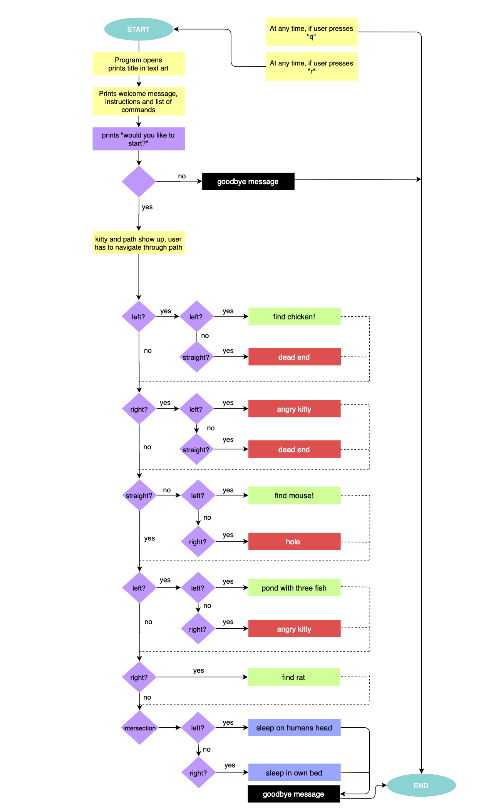

(Since completing the app, it differs from this diagram)

## Implementation Plan

##### Opening Screen 

1. figure out how to get text art 
2. figure out how to print text art
3. pick text art to use
4. create welcome screen rb
5. create welcome method including opening screen and greeting and instructions
6. use colorize gem to add colour
7. figure out how to print different sections of message at one time.

##### Greeting and Instructions

1. write out instructions and beginning story
2. assign variables for commands for the user to use
3. figure out how to assign different keys to move the emoji
4. use .center to have the text centered

##### Begin Game

1. create game.rb
2. create a class for game 
3. figure out how to draw the game DONE
4. draw the game
5. figure out how to create barriers for the game
6. figure out how to have the obstacles pop up when the user nears them
7. figure out how to print messages when the user is at certain positions.
8. figure out how to make foods dissapear when user navigates to them.
9. figure out how to use emojis - unicode
10. collect all unicodes for emojis
11. create game over message 
12. create game win message
13. put board in array

## Help 

##### Steps to install

- Download the app zip file.

- Open the zip file.

- Open your terminal, enlarge to fill the screen.

- Navigate to the opened zip file

- Navigate to the 'src' directory

- Eg. cd .../downloads/terminal_app/src

- In your terminal, run the following:

```
bash run_app.sh
```

- (optional) If you'd like to skip the program asking for your name, type it in the same line:

```
bash run_app.sh name
```

##### Dependencies 

- To use this application, You require the ruby gems which are included in the file.

##### Features 

- As this game begins it will ask you for your name then greet you and print the title.
- It will then prompt you to type 's' to start. If you press something other than 's', it will print "Invalid" and you will be required to type 's'.
- It will then print the instructions and ask you if you would like to begin, again if you type something other than 'y' or 'n' it will tell you to try again. 
- If you type 'n' it will print a game over message, if you type 'y' it will continue to the board and you will have to use the arrow keys to navigate through the path to find the snacks and avoid the obstacles, then you have to decide between a bed and their owner's face to sleep on.
- Once finished, a congratulations message will be printed.
- If at any time after the instructions you wish to quit, type 'q'.


## Testing

##### Manual Testing Table

| Feature                         | What It Is                                                   | Expected Outcome                                             | Actual Outcome                                               | Is It a Problem?                                             |
| ------------------------------- | ------------------------------------------------------------ | ------------------------------------------------------------ | ------------------------------------------------------------ | ------------------------------------------------------------ |
| Command Line Argument - name    | Run the program from the terminal and write your name after.<br/>Eg. “ruby app.rb meika” | This should skip asking you for your name and print a greeting with your name. | Problem arised, but was handled. Now works as expected.      | It was a problem, as it would throw an error for using ‘gets’ later on in the program, this was fixed by inserting “ARGV.clear” afterwards. It is no longer a problem. |
| Welcome Screen                  | A screen which asks you for your name(if not given in CLI), prints the title gradually, and asks if you are ready to start. | Should ask for name and print greeting with name. Text should print by character, in blue. Title should print by line in red. Ready to start question should print by character in blue. | As expected.                                                 | no                                                           |
| Title                           | ASCII text of title.                                         | Print by line in red                                         | As expected.                                                 | no                                                           |
| Would you like to start?(s)     | Question asking if you are ready to start, have to press ‘s’. | When ‘s’ is pressed, screen should go to instructions, if something other than ‘s’ is pressed, invalid message will print, user will have to enter ‘s’. | As expected.                                                 | no                                                           |
| Instructions                    | Instructions for game.                                       | Should print by sentence, in blue, with magenta line breaks in between. | As expected.                                                 | no                                                           |
| Would you like to start(y or n) | Question asking if you are ready to start, have to press ‘y’ or ‘n’. | When ‘y’ is pressed, game will begin. When ‘n’ is pressed game over message will print. When something else is print, error is handled and user is required to press ‘y’ or ‘n’. | As expected.                                                 | no                                                           |
| Board prints                    | Board layout prints.                                         | Board I have designed gets printed.                          | I spent a large amount of time attempting to perfect the design of the board and turn it into arrays that can be used functionally. It works now, although, because of the emojis the spacing in the board is inconsistent and looks messy, I am yet to find a solution to this problem. The board also moves when the emoji moves which  haven’t fixed yet. | Functionally, no, aesthetically, yes.                        |
| Emoji                           | Moving emoji with arrow keys.                                | Using the arrow keys the user may move the cat emojis across the spaces in the board. | I also spent a large amount of time on this trying to get it to work, studying other code and finally getting it to work. Although, I couldn’t find a solution to this myself, I looked at the way, the creator of the maze game shown in class achieved this, and tried to recreate that in my own way. | No                                                           |
| Food + food messages            | Food emojis in game, when user moves cat emoji to them, they dissapear and message prints. | Food emojis scattered on board, when user goes to them they disappear and a message is printed. | As expected.                                                 | No, it does cause issues for the board though.               |
| Obstacle messages               | Obstacle emojis scattered on board,Message prints when user is near. | When close to obstacles a warning message is printed to user. Can’t interact with them. | I tried to include the code for these messages in the same case statements used to move the objects, however it did not work and I had to create its own case. | No                                                           |
| "q"                             | Quit.                                                        | When user presses ‘q’ during gameplay, game over message is printed. | As expected.                                                 | No                                                           |
| Bed                             | Finish point 1.                                              | When user goes to bed, congratulations message is printed.   | As expected.                                                 | No                                                           |
| Sleeping head                   | Finish point 2.                                              | When user goes to sleeping head, congratulations message is printed. | As expected.                                                 | No                                                           |
| Game over                       | game over message                                            | When user quits game, game over message is printed in red.   | As expected.                                                 | No                                                           |
| Game finished                   | congratulations message                                      | When user finishes game, congratulations message is printed. | As expected.                                                 | No                                                           |

##### Test Cases

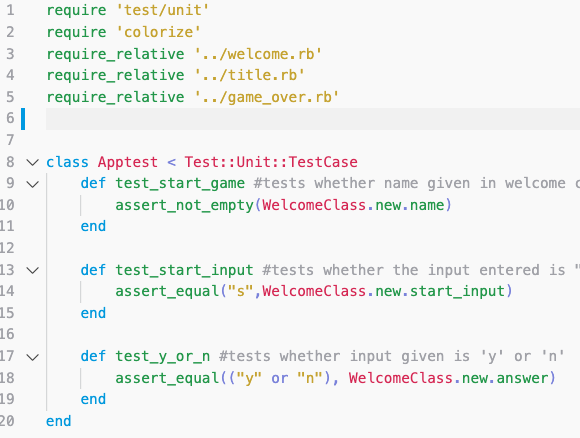

To test my app, I created three test cases.

1. The first test case I created tests whether the name given by the user is empty or not. 


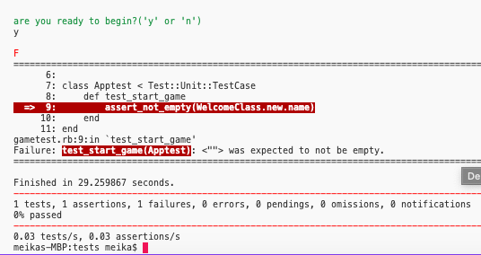


2. The second test I created tests whether, when asked to enter 's', if 's' is entered and fails if not.


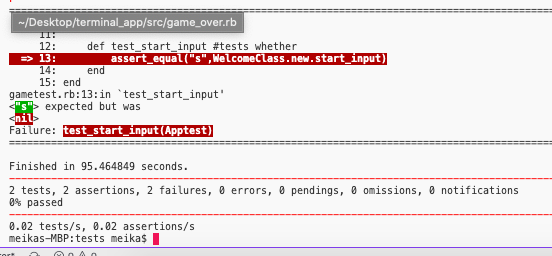


3. The third test I created tests whether, when asked to enter 'y' or 'n' if they are actually entered.

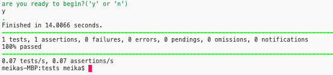


## Original Board design

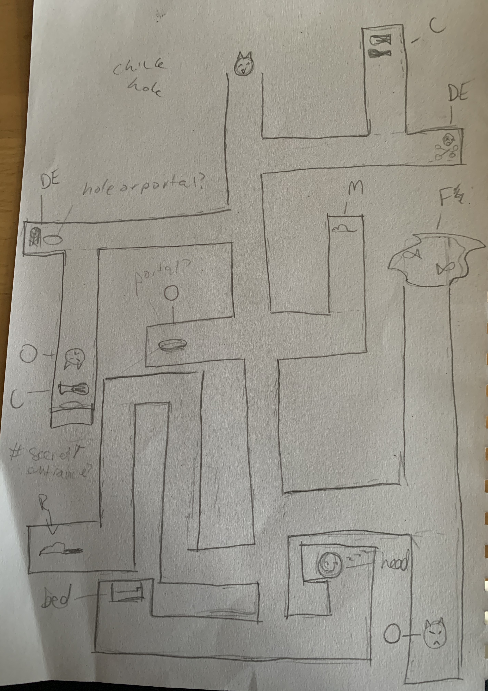


## Development Log

### Mon 20/4

- Got given task and shown examples
- Thought about ideas and researched options
- Had ideas ready to review

### Tuesday 21/4

- Reviewed idea with teacher and got approval
- Began planning and researching

### Wednesday 22/4

- Completed planning
- Began studying other code and trying to figure out how to achieve my desired goal
- Started building board and trying to get it to work

### Thursday 23/4

- Still building board and getting it to work

- Trying to find other ways to achieve my goal through research

- Started to code and try and get it to function properly

  

### Friday 24/4

- Writing code, still not functioning
- trying to find solutions, while also trying to research gems to use

### Saturday 25/4

- Worked meticulously to try complete everything, however code is still not functioning as expected.
- Finally got code to work, still adding features

#### Status update 11:17AM

I have encountered a significant issue while attempting to create my app. As the basic concept of my app is very similar to an example given by my educators I decided to try and learn how the creator of it managed the task. I studied the code and attempted to use it build a foundation for my board and learn how to move objects using arrow keys through a path. 

This was more difficult than I had thought and ended up spending a good chunk of time trying to understand it, as well as scouring the internet for solutions or ideas but with no luck. I finally understand it and have used it to build and format my own board. I will now try to create the code to get it to work myself in my own way.


### Sunday 26/4

- Worked meticulously all day to complete work and still finish my code.
- Making program prettier
- Writing error handling methods
- Writing tests
- Writing help file
- Trying to write bash script - coming up with an error

### Monday 27/4

- Got up early to finish work - still not complete
- Trying to get bash script to run
- Rewrote tests which work
- Finalised everything

#### Status update 5:38PM

I have just completed my tests and everything is working as it should be. After encountering many issues and solving them, my game is functional and I am nearly finished most of the assignment.

### Screenshots from trello board:

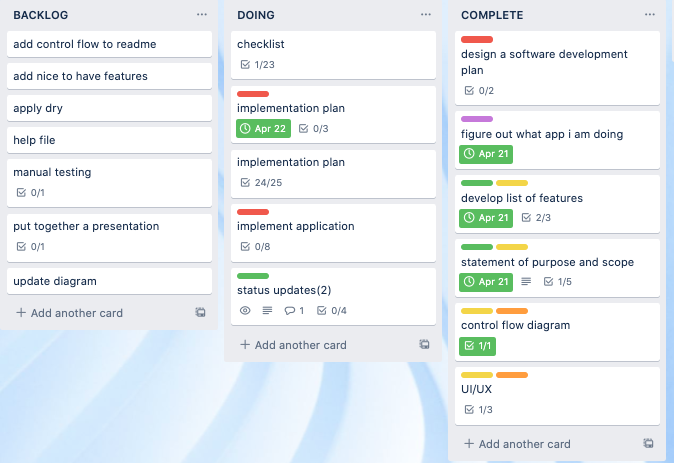

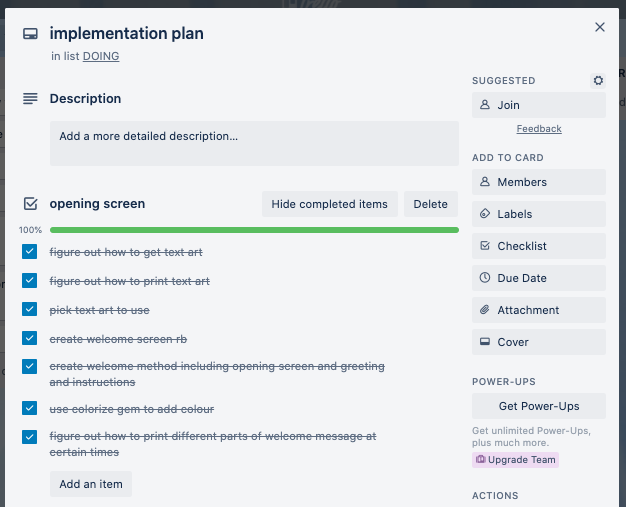

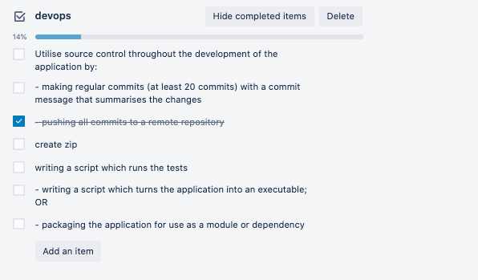


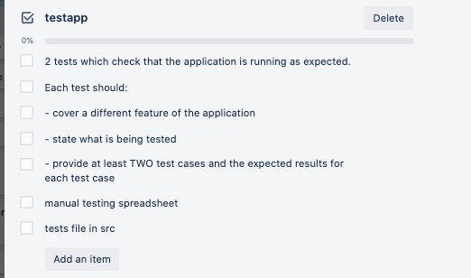


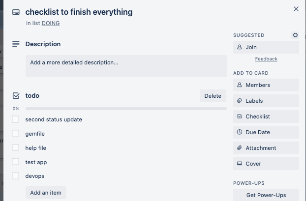

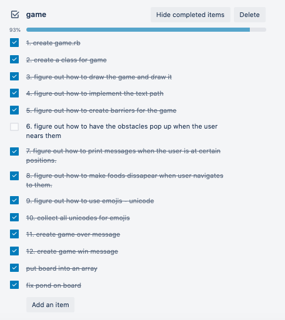

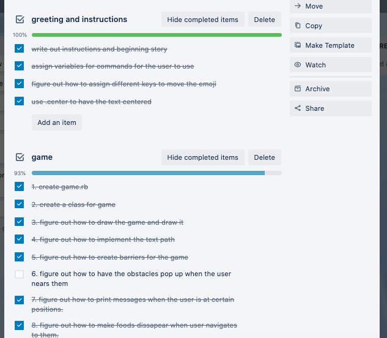

